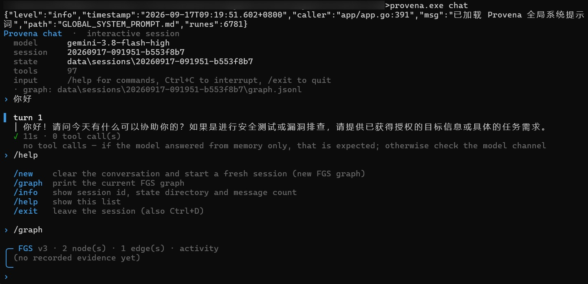

<div align="center">

# Provena

**证据驱动的安全测试智能体 · CLI 命令行版本**

把一句自然语言目标，变成针对单个授权目标的有界、可审计测试

[](https://go.dev/dl/)
[](#环境要求)
[](https://github.com/youki992/Provena/releases)
[](LICENSE)

[中文](README.md) · [English](README_EN.md)



</div>

Provena 把一句自然语言目标，转化为针对单个授权目标的有界、可审计安全测试。

每一次运行都会驱动 Pi harness 走一条 fact/intent 图流程：由模型决定下一步做些什么，而 Provena 则负责调用内置工具执行，每次获取的证据都会记录进只追加的 FGS 图中，最终生成报告。

项目以 Go 编写，工具以 YAML 配置文件进行配置，同一个智能体既能调用本地扫描器，也能调用远端 MCP 服务或 Provena 内置工具。

> [!IMPORTANT]
> 本仓库是命令行工具：`chat`、`run`、`doctor`、`init`、`config`、`version`。
> 仅可对自有系统或已获得明确授权的目标使用，详见 [SECURITY.md](SECURITY.md)。

---

## 亮点

| | 能力 | 说明 |
| :---: | --- | --- |
| 🧠 | **Pi harness 驱动** | 模型只负责决策，工具由 Provena 判断是否需要调用执行 |
| 🕸️ | **只追加的 FGS 图** | 观察事实记录进 fact/intent 图，产生结论前必须要存在对应证据 |
| 🧰 | **100+ 工具配置** | YAML 声明、MCP 调用；支持配置本地扫描器工具与远端 MCP |
| 📄 | **三种报告格式** | `md` / `json` / `sarif`，SARIF 可直接接入进 CI |
| 🙋 | **HITL 审批** | 高风险动作可先审批，可由人工或审计 Agent 接管 |
| 📦 | **单文件交付** | Windows / Linux 开箱即用的可执行文件 |

运行一次任务的生命周期：

```text
provena run -t <目标>
      │
      ├─► 模型决策 ──► 调用工具 ──► 记录事实 ──► 更新 FGS 图
      │        ▲                                  │
      │        └──────────── 回放给下一轮 ◄───────┘
      │
      └─► data/runs/<run-id>/   graph.jsonl + report.{md,json,sarif}
```

---

## 环境要求

| | |
| --- | --- |
| **操作系统** | 64 位 Windows 或 Linux。内置扫描器启动器（`tools/bundled_tool.py`）无 macOS 分支。 |
| **Go** | 1.25 及以上（以 `go.mod` 为准） |
| **Node.js + npm** | 用于安装并运行 Pi（见下一行） |
| **Pi** | `pi` 命令行工具，需在 `PATH` 中。安装：`npm install -g @mariozechner/pi-coding-agent`。Provena 把它作为智能体运行时驱动（`pi --mode rpc`）；可用 `pi_agent.command` 指向其他可执行文件。 |
| **模型** | 任意兼容 OpenAI 协议的对话接口。Provena 会把所选通道的 `provider`、`base_url`、`api_key`、`model` 交给 Pi，因此在 `ai.channels` 里配置即可。 |
| **Python** | 3.10 及以上 |

`provena doctor` 会在真正跑任务前，把配置、AI 通道、pi 运行时、python、tools/skills/agents 目录以及所有已配置的 MCP 服务器都检查一遍。

---

## 构建

```bash
git clone https://github.com/youki992/Provena.git
cd Provena

go build -o provena ./cmd/provena        # Linux
go build -o provena.exe ./cmd/provena    # Windows
```

当前版本为 **v0.1.0**，即 `cmd/provena/main.go` 里的默认值，与 `config.example.yaml` 的 `version` 字段保持一致。构建完成后可自行确认：

```bash
./provena version     # provena v0.1.0
./provena help        # 命令列表；没有 serve 子命令
```

---

## 快速上手

```bash
./provena init            # 由 config.example.yaml 生成 config.yaml
```

然后在 `config.yaml` 中配置一个 AI 通道：

```yaml
ai:
  default_channel: openai-main
  channels:
    openai-main:
      provider: openai_compatible
      api_key: "${OPENAI_API_KEY}"
      base_url: "https://api.openai.com/v1"
      model: "your-model"
```

```bash
./provena doctor          # 校验配置、模型凭证、python 与 MCP 接线
./provena run -t https://example.com --objective "复查登录流程"
```

> [!TIP]
> `provena doctor` 与 `provena run --dry-run` 都会在不调用模型的前提下完整解析接线关系，建议在消耗 token 之前先用它们自检。

---

## 命令一览

| 命令 | 作用 |
| --- | --- |
| `provena chat` | 交互式多轮会话，可打断、可恢复 |
| `provena run` | 针对单个目标的有界命令行测试 |
| `provena doctor` | 检查配置、模型凭证、pi、python 与 MCP 服务器 |
| `provena init` | 由内置示例生成 `config.yaml` |
| `provena config validate` | 校验配置文件 |
| `provena version` | 打印版本号 |

所有命令都支持 `-config <path>`（默认 `config.yaml`）。

---

## 交互式会话

`provena chat` 在整个对话期间只保持一个 Pi 进程，因此模型能看到之前的轮次，会话也可以随时打断与恢复：

```bash
provena chat -t https://example.com --objective "复查登录流程"
provena chat --continue        # 接着最近一次会话继续
```

| 会话内命令 | 作用 |
| --- | --- |
| `/new` | 清空对话，并把 FGS 图轮换到新文件 |
| `/graph` | 打印当前 FGS 图 |
| `/info` | 显示会话 id、消息数与 Pi 的 session 文件 |
| `/help`、`/exit` | 命令列表、退出 |

第一次 <kbd>Ctrl</kbd>+<kbd>C</kbd> 中止当前轮并保留对话，第二次才退出。会话状态保存在 `data/sessions/<id>/`。

---

## 命令行运行

`provena run` 复用与 `chat` 相同的智能体内核，只是不再有交互提示：

```bash
provena run -t https://example.com \
  --objective "检查 API 的访问控制问题" \
  --scope https://example.com \
  --max-activities 6 \
  --format sarif
```

| 参数 | 作用 |
| --- | --- |
| `-t`、`-target` | **必填。**目标 URL、主机或 host:port。 |
| `--objective` | 本次运行要达成的目标；默认做一次通用低影响评估。 |
| `--scope` | 逗号分隔的授权范围；默认等于目标。 |
| `--max-activities` | 模型活动轮数上限（默认 6）。 |
| `--format` | 输出到 stdout 的报告格式：`md`（默认）、`json` 或 `sarif`。 |
| `-as` | 本次运行使用的 RBAC 用户（默认 `admin`）。 |
| `--dry-run` | 只解析并校验全部接线，不调用模型。 |
| `-v` | 除工具名外还打印工具结果。 |

每次运行写入 `data/runs/<run-id>/`：

| 文件 | 内容 |
| --- | --- |
| `graph.jsonl` | 只追加的 Fact/Intent 图（运行的持久状态） |
| `report.md` · `report.json` · `report.sarif` | 发现、证据与严重程度 |

> [!WARNING]
> 报告中记录的 Finding 是「有证据支持的观察」，**不等于已确认漏洞**，请先验证再处置。

---

## 工具

### 仓库不内置任何工具，请自行下载

本仓库 **不携带任何第三方扫描器二进制，也没有 `tools/bin` 目录**。请到各工具自己的上游 Release 页面下载，然后放到 Provena 约定的位置。

工具的运行方式、YAML 配置格式以及如何新增自定义工具，见 [tools/README.md](tools/README.md)（中文）与 [tools/README_EN.md](tools/README_EN.md)（英文）。

<details>
<summary><b>内置扫描器 —— <code>tools/bin/&lt;工具名&gt;/&lt;平台&gt;/&lt;工具名&gt;[.exe]</code></b></summary>

<br>

下列几个工具由 [`tools/bundled_tool.py`](tools/bundled_tool.py) 拉起，它在**仓库内部**解析可执行文件，而不走 `PATH`。请把二进制放到：

```
tools/bin/<工具名>/<平台>/<工具名>[.exe]
```

其中 `<平台>` 在 Windows 上是 `windows-amd64`，在 Linux 上是 `linux-amd64`。

| 工具 | 定义文件 | 期望路径 | 上游来源 |
| --- | --- | --- | --- |
| `amass` | `tools/amass.yaml` | `tools/bin/amass/<平台>/amass[.exe]` | `owasp-amass/amass` |
| `subfinder` | `tools/subfinder.yaml` | `tools/bin/subfinder/<平台>/subfinder[.exe]` | `projectdiscovery/subfinder` |
| `ffuf` | `tools/ffuf.yaml` | `tools/bin/ffuf/<平台>/ffuf[.exe]` | `ffuf/ffuf` |
| `gau` | `tools/gau.yaml` | `tools/bin/gau/<平台>/gau[.exe]` | `lc/gau` |
| `katana` | `tools/katana.yaml` | `tools/bin/katana/<平台>/katana[.exe]` | `projectdiscovery/katana` |
| `waybackurls` | `tools/waybackurls.yaml` | `tools/bin/waybackurls/<平台>/waybackurls[.exe]` | `tomnomnom/waybackurls` |
| `nmap` | `tools/nmap.yaml` | 见下文 | 自行安装 |

前 6 个都是常见的开源 Release：到对应项目的 Release 页面下载你的平台包，把可执行文件拷到上面的路径即可。以 Linux 上的 ffuf 为例：

```bash
mkdir -p tools/bin/ffuf/linux-amd64
# 解压 ffuf 的 Release 包，然后
cp ffuf tools/bin/ffuf/linux-amd64/ffuf
chmod +x tools/bin/ffuf/linux-amd64/ffuf
```

唯一区别：

- **`nmap` 不是可以直接丢进去的单个文件。** Windows 上请正常安装 Nmap：查找器会先看`%ProgramFiles%\Nmap\nmap.exe` 和 `%ProgramFiles(x86)%\Nmap\nmap.exe`，再退回`tools/bin/nmap/windows-amd64/nmap.exe`。
- Linux 上查找器只看`tools/bin/nmap/linux-amd64/nmap`，所以要么把二进制拷到那里，要么改配置直接调用系统安装的 nmap —— 在 `tools/nmap.yaml` 里把 `command` 改成 `"nmap"`，并去掉 `args` 中的`tools/bundled_tool.py` 相关项。

查找顺序与例外：

- **二进制缺失** —— 运行不会失败。工具会列出它检查过的全部路径，智能体跳过该工具继续执行。

</details>

<details>
<summary><b>Python 类工具</b></summary>

<br>

部分配置调用 `python` / `python3`，按 `PATH` 解析（Windows 上回退到 `py`）。建议创建虚拟环境并安装共享依赖：

```bash
python -m venv venv
source venv/bin/activate          # Windows: venv\Scripts\activate
pip install -r requirements.txt
```

`http-framework-test`、`api-fuzzer` 以及 ARL 系列工具都期望该环境已激活。

</details>

<details>
<summary><b>依赖全局安装的工具</b></summary>

<br>

`tools/` 里 100+ 个配置中的大多数按名称调用命令，期望它在 `PATH` 上 —— 例如 nmap、nikto、sqlmap、nuclei、gobuster、hydra、hashcat 等。请用包管理器或到上游安装：

```bash
# Linux（Kali / Debian / Ubuntu）
sudo apt install -y nmap sqlmap nikto gobuster hydra hashcat john binwalk
```

Windows 上没有一条包管理器命令能覆盖它们：请逐个到各工具自己的项目页面安装，通常是签名安装包，或解压后放进 `PATH` 的 Release 包。

工具缺失时运行期会跳过，而不会让整次运行失败。

</details>

---

## 配置

[`config.example.yaml`](config.example.yaml) 是权威配置模板。最少只需按[快速上手](#快速上手)配置一个 AI 通道。

`openai` 是兼容旧版本的运行时字段，新配置请统一维护在 `ai.channels` 下。[`config.example.yaml`](config.example.yaml) 是最权威的配置说明，每一段都有中文注释。

---

## 项目结构

```
Provena/
├── cmd/provena/     # CLI 入口（main、chat、run、doctor、init、config）
├── internal/        # 智能体内核、FGS 图、MCP、工具、报告、安全执行器
├── tools/           # YAML 工具配置 + bundled_tool.py 启动器
├── roles/           # 角色配置（按场景的提示词与工具策略）
├── agents/          # 多代理 Markdown（orchestrator.md + 子代理）
├── docs/            # 专题文档
├── evals/           # 评测样本
├── images/          # README 预览图
├── config.example.yaml
└── SECURITY.md
```

以下目录由你自行准备，不属于仓库内容：`tools/bin/`（扫描器二进制）、`skills/`（Agent Skills）、`mcp-servers/`（外部 MCP 服务）、`data/`（运行状态、数据库、会话）以及 `config.yaml`。

---

## 相关文档

| 文档 | 说明 |
| --- | --- |
| [排错指南](docs/zh-CN/troubleshooting.md) | 按现象列出常见问题 |
| [MCP 联邦](docs/zh-CN/mcp-federation.md) | 内置 MCP、外部 MCP 与工具命名 |
| [知识库](docs/zh-CN/knowledge-base.md) | 检索、Rerank 与内容编写 |
| [Skills 指南](docs/zh-CN/skills-guide.md) | SKILL.md 结构与渐进式披露 |
| [命令行运行冒烟测试](docs/zh-CN/provena-run-smoke.md) | 真实靶机端到端流程（仅中文） |
| [双语文档索引](docs/README.md) | 全部文档入口 |

---

## 许可证

Provena 采用 **Apache License 2.0** 开源许可。完整条款见 [LICENSE](LICENSE)。

## ⚠️ 免责声明

**本工具仅供教育和授权测试使用！**

Provena 是一个专业的安全测试工具，旨在帮助安全研究人员、渗透测试人员和 IT 专业人员在**获得明确授权**的前提下进行安全评估与漏洞研究。

**使用本工具即表示您同意：**

- 仅在您拥有明确书面授权的系统上使用
- 遵守所有适用的法律法规和道德准则
- 对任何未经授权的使用或滥用行为承担全部责任
- 不会将本工具用于任何非法或恶意目的

**开发者不对任何滥用行为负责。** 请确保您的使用符合当地法律法规，并获得目标系统所有者的明确授权。

安全问题报告与加固建议见 [SECURITY.md](SECURITY.md)。
