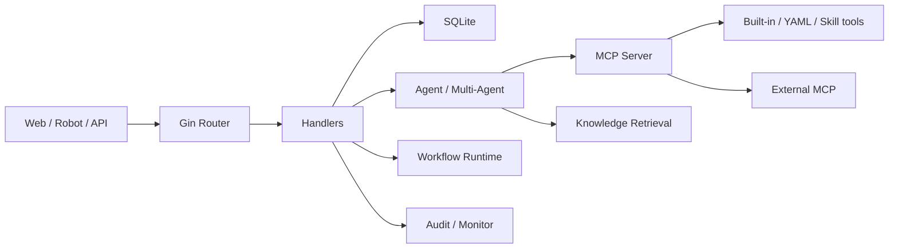

# Architecture

[中文](../zh-CN/architecture.md)

Provena is a single Go binary: an MCP tool registry, agent orchestration, a fact/intent graph, knowledge retrieval, and optional C2/WebShell tool subsystems.

## Overview

## Cross-Cutting Modules

- Project facts are injected into Agent context.
- HITL sits before tool execution.
- Monitor records tool execution and supports cancellation/review.
- Audit records platform management actions.
- Tool search controls what tools the model can currently see.

These are not just pages; they affect many runtime paths.

## Complexity Hotspots

- `internal/multiagent/`: streaming, retry, summarization, middleware, tools.
- `internal/security/`: auth and shell execution boundary.
- `internal/database/`: SQLite schema compatibility.

## Design Trade-Offs

The project uses a single Go service, static frontend, and SQLite to keep deployment simple. The trade-offs:

- multi-instance scale is not automatic;
- runtime files must be backed up carefully;
- high-privilege tools and admin UI live in one process, so deployment isolation matters.

## Source Anchors

- App wiring: `internal/app/app.go`; routes: `internal/app/routes.go`
- Handlers: `internal/handler/`
- Multi-agent: `internal/multiagent/`
- MCP: `internal/mcp/`
- DB: `internal/database/`
