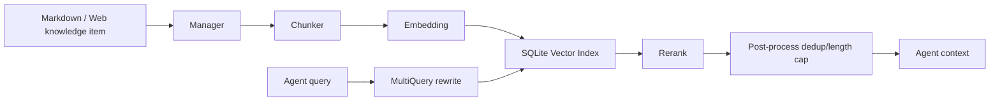

# Knowledge Base

[中文](../zh-CN/knowledge-base.md)

The knowledge base turns local security knowledge, vulnerability handbooks, testing methods, and organizational experience into retrievable context, so Agents can reference it on demand during a task.

## Enable

```yaml
knowledge:
  enabled: true
  base_path: knowledge_base
  embedding:
    provider: openai
    model: text-embedding-v4
    base_url: ""
    api_key: ""
database:
  knowledge_db_path: data/knowledge.db
```

When `embedding.base_url/api_key` are left empty, the `openai` configuration is reused. It is recommended to keep the knowledge base database separate so it is easy to migrate and reuse.

## Content Directory

The default directory is `knowledge_base/`. The project already contains an example:

```text
knowledge_base/
  SQL Injection/
    README.md
    MySQL Injection.md
  Prompt Injection/
    README.md
```

It is recommended to use top-level directories to represent risk types or knowledge domains, such as:

- `SQL Injection`
- `XSS`
- `File Upload`
- `Cloud Security`
- `Incident Response`

## Indexing

Indexing configuration:

```yaml
knowledge:
  indexing:
    chunk_size: 512
    chunk_overlap: 50
    max_chunks_per_item: 0
    max_rpm: 0
    rate_limit_delay_ms: 300
    max_retries: 3
    retry_delay_ms: 1000
    chunk_strategy: markdown_then_recursive
    request_timeout_seconds: 120
    prefer_source_file: false
    batch_size: 10
    sub_indexes: []
```

Recommendations:

- Use `markdown_then_recursive` when document structure is clear.
- When the embedding endpoint is strictly limited, lower `batch_size` and increase `rate_limit_delay_ms`.
- For a single overly long document, set `max_chunks_per_item` to control cost.
- Use `sub_indexes` and `sub_index_filter` when you need to isolate by business domain.

## Retrieval

```yaml
knowledge:
  retrieval:
    top_k: 5
    similarity_threshold: 0.4
    multi_query:
      max_queries: 4
    post_retrieve:
      prefetch_top_k: 20
      max_context_chars: 0
      max_context_tokens: 0
```

The retrieval chain is roughly:

1. A user query or an Agent query.
2. MultiQuery rewrites it into several semantic variants.
3. Vector retrieval fetches candidate chunks.
4. rerank re-orders them precisely.
5. Post-processing deduplicates and caps length.
6. Returned to the Agent or the API caller.

If `similarity_threshold` is too high it misses recall; if too low it brings in noise. An initial value of 0.35 to 0.45 is recommended.

## Rerank

```yaml
knowledge:
  retrieval:
    rerank:
      provider: ""
      model: ""
      base_url: ""
      api_key: ""
```

When left empty it is inferred from `base_url`. DashScope commonly uses `gte-rerank`; other OpenAI-compatible endpoints may go to `/v1/rerank`. If the provider does not support rerank, retrieval quality may decrease, so it is recommended to lower `top_k` and improve the quality of knowledge entries.

## MCP Tools

After the knowledge base is enabled, capabilities such as the following are registered:

- List risk types.
- Search the knowledge base.
- Fetch related knowledge fragments.

In a role prompt you can write:

```text
When unsure about vulnerability verification, remediation advice, or detection methods, query the knowledge base first, then give a conclusion.
```

## Content Writing Suggestions

Each knowledge entry is recommended to include:

- Applicable scenarios.
- Detection methods.
- Verification steps.
- Common false positives.
- Remediation advice.
- Example tool commands.
- Reference links or internal standards.

Avoid piling unrelated topics into the same long document. Small, clear documents are better for chunking and recall.

## Troubleshooting

Indexing failures:

- Check the embedding API Key, model name, and base_url.
- Lower `batch_size`.
- Increase `request_timeout_seconds`.
- Look at 400/401/429/5xx in the service logs.

Empty retrieval:

- Check whether the index has been rebuilt.
- Lower `similarity_threshold`.
- Check whether `categories` recognized the risk type.
- Do not use an overly narrow `riskType` when searching.

Inaccurate recall:

- Improve the heading hierarchy.
- Split mixed content into multiple documents.
- Add key terms and synonyms.
- Adjust `top_k`, `prefetch_top_k`, and the rerank configuration.

## Internal Data Flow

The knowledge base chain is not "full-text search" but a multi-stage retrieval system:



Therefore retrieval quality depends on four things: source structure, chunk granularity, embedding quality, and rerank availability. Simply tuning `top_k` is often not the most effective approach.

## Knowledge Item Writing Counter-example

A bad knowledge entry:

```text
SQL injection is dangerous; you can scan it with sqlmap, and the fix is filtering.
```

A good knowledge entry:

```markdown
# MySQL UNION Injection Verification

## Preconditions
- The parameter enters a SELECT query and is concatenated directly.
- The page returns a wrong number of fields or a wrong type.

## Verification Steps
1. Use `' order by 1-- -` to increment the column count.
2. Use `union select null,...` to check the reflection position.
3. Use a read-only function to confirm the database type, for example `database()`.

## False Positive Exclusion
- A WAF injection-blocking page may mimic a SQL error.
- A unified error page cannot directly prove injection.

## Fix
- Parameterized queries.
- Least database privilege.
- Unified error handling that does not swallow security logs.
```

The second style gives the chunk enough headings, terms, and step signals, and the Agent can execute it directly.

## Tuning Method

First fix a set of test questions, for example:

```text
How do you determine the number of columns in a MySQL union injection?
How do you verify cloud metadata access via SSRF?
What false positives exist for file upload blacklist bypass?
```

Then tune item by item:

1. Empty search: lower `similarity_threshold` and confirm indexing has finished.
2. Wrong topic: improve document title quality and add a risk type filter.
3. Broken result fragments: increase `chunk_overlap` or lower `chunk_size`, then rebuild the index.
4. Too much noise: raise `similarity_threshold` and enable/fix rerank.
5. High cost: lower `multi_query.max_queries`, `prefetch_top_k`, and `top_k`.

Change only one parameter at a time and record the query results, otherwise you cannot tell which variable had an effect.

## How to Use Retrieval Logs

Retrieval logs are not just for troubleshooting; they can also drive improvements to the knowledge base in reverse:

- High-frequency no-result queries: knowledge is missing or synonyms are insufficient.
- High-frequency low-score queries: document titles and terms do not match.
- The same question retrieves several duplicate documents: they need to be merged or given a category.
- The Agent often ignores knowledge base results: the results are too long, too scattered, or lack a clear conclusion.

## Source Anchors

- Knowledge management: `internal/knowledge/manager.go`
- Index pipeline: `internal/knowledge/index_pipeline.go`
- Eino chunk: `internal/knowledge/chunk_eino.go`
- Retriever: `internal/knowledge/retriever.go`
- Eino retrieval chain: `internal/knowledge/eino_retrieve_chain.go`
- rerank: `internal/knowledge/rerank_http.go`
- MCP tools: `internal/knowledge/tool.go`
