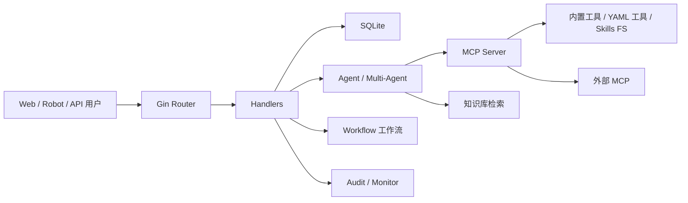

# 架构说明

Provena 是一个以 Web 管理面为入口、以 Agent 和 MCP 工具为执行核心的安全测试编排平台。

## 总览

## Agent 层

单代理和多代理主要在：

- `internal/agent/`
- `internal/multiagent/`
- `internal/agents/`
- `agents/`

Eino ADK 提供单代理、Deep、Plan-Execute、Supervisor 等执行模式。多代理子 Agent 由 Markdown 文件定义。

## MCP 与工具

MCP 相关：

- `internal/mcp/`：Server、外部 MCP、连接恢复。
- `internal/einomcp/`：Eino 与 MCP 工具适配。
- `tools/`：YAML 命令工具。
- `internal/app/*_tools.go`：Go 内置工具注册。

工具调用会进入监控记录，并可受 HITL 审批影响。

## Workflow

工作流引擎在 `internal/workflow/`。它支持 start、agent、tool、condition、hitl、output、end 等节点。

## 知识库

知识库在 `internal/knowledge/`，包括：

- Markdown/文本内容管理。
- chunk。
- embedding。
- SQLite 向量索引。
- multi-query。
- rerank。
- 检索日志。

启用后会向 Agent 暴露知识检索工具。

## 数据层

`internal/database/` 封装 SQLite 访问，保存：

- 对话、消息、过程详情。
- 分组。
- 工具执行记录。
- HITL 日志。
- 知识库索引和检索日志。
- 漏洞、项目、任务等业务数据。

默认数据库文件：

- `data/conversations.db`
- `data/knowledge.db`

## 安全与审计

`internal/security/` 提供认证、限流、Shell 执行和命令流处理。`internal/audit/` 和 `internal/monitor/` 分别负责平台审计和执行监控。

高风险模块包括：

- Terminal。
- 外部 MCP。
- 文件系统和 Shell Skills。

这些模块应结合角色、HITL 和部署隔离使用。

## 横向模块依赖

几个模块不是独立页面，而是横向能力：

- Project facts：会被注入 Agent 上下文，影响多轮和跨对话判断。
- HITL：插在工具调用前，影响所有 Agent/MCP 工具。
- Monitor：记录工具执行，影响任务取消、复盘和通知。
- Audit：记录平台管理动作，影响安全运营。
- Tool search：影响模型看见哪些工具，而不仅仅是工具页面显示。

改这些模块时要看全局调用点，不要只测单个页面。

## 复杂度热点

维护时优先警惕：

- `internal/app/app.go`：组装所有服务，容易引入初始化顺序问题。
- `internal/multiagent/`：中间件多，流式、重试、摘要和工具调用交错。
- `internal/security/`：Shell 和认证是安全边界。
- `internal/database/`：SQLite 结构演进必须兼容旧数据。

## 设计取舍

项目选择单个 Go 二进制 + SQLite，是为了降低部署门槛。但代价是：

- 多实例横向扩展不天然成立，尤其 SQLite 写入和内存 session。
- 运行态配置和本地文件强绑定，需要良好备份。
- 高权限工具和 Web 管理面在同一进程内，部署隔离更重要。

这些不是缺陷，而是部署时必须理解的边界。
